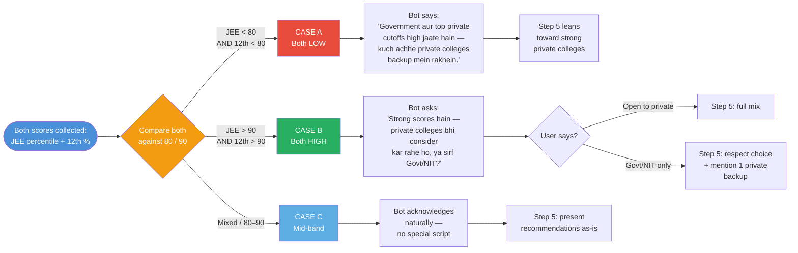
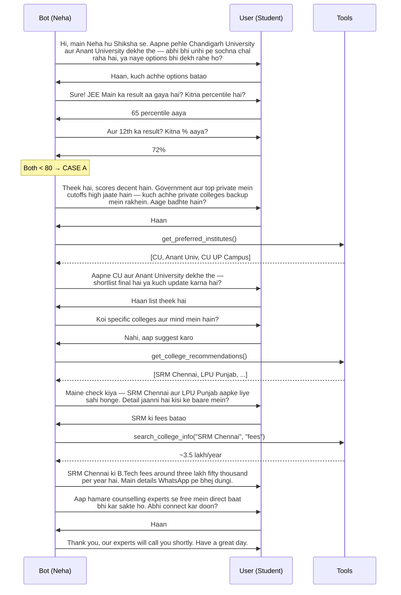

# Voice Bot — Call Flow Visualization

This is a visual representation of how a typical call should play out based on [voice_bot_system_prompt.md](voice_bot_system_prompt.md).

---

## 1. End-to-End Call Flow

```mermaid
flowchart TD
    START(["Call connects"]) --> S1["STEP 1<br/>Open with rapport hook<br/>(reference past colleges)"]
    S1 --> S1Q{"User intent?"}
    S1Q -- "Exploring" --> S2
    S1Q -- "Not looking" --> S1B["Pitch: discuss<br/>important steps?"]
    S1Q -- "Uninterested" --> ENDBYE(["End: 'Thank you,<br/>Have a great day'"])
    S1B -- "Yes" --> S2
    S1B -- "No" --> ENDBYE

    S2["STEP 2<br/>Mini-Qualification<br/>(JEE + 12th only)"] --> Q1{"Q1: JEE Main<br/>result out?"}
    Q1 -- "Yes — share %" --> Q1ACK["Acknowledge score"]
    Q1 -- "No / pending" --> Q1A["Ask: kitna<br/>expect kar rahe ho?"]
    Q1A --> Q1ACK
    Q1ACK --> Q2{"Q2: 12th<br/>result out?"}
    Q2 -- "Yes — share %" --> Q2ACK["Acknowledge score"]
    Q2 -- "No / pending" --> Q2A["Ask: kitna<br/>expect kar rahe ho?"]
    Q2A --> Q2ACK

    Q2ACK --> BRANCH{"Score-based<br/>branching"}
    BRANCH -- "Both < 80<br/>(Case A)" --> CASEA["Soft nudge:<br/>keep private<br/>colleges as backup"]
    BRANCH -- "Both > 90<br/>(Case B)" --> CASEB["Ask: open to<br/>private colleges,<br/>or only Govt/NIT?"]
    BRANCH -- "Mixed / 80-90<br/>(Case C)" --> CASEC["Acknowledge<br/>naturally"]

    CASEA --> SUM["Summarise:<br/>'JEE X aur 12th Y.<br/>Iske basis pe…'"]
    CASEB --> SUM
    CASEC --> SUM

    SUM --> S3["STEP 3<br/>Confirm shortlist<br/>(call get_preferred_institutes)"]
    S3 --> S3Q{"User response?"}
    S3Q -- "Confirms list" --> S4
    S3Q -- "Updates list" --> S3ACK["Acknowledge<br/>new choices"]
    S3ACK --> S4

    S4["STEP 4<br/>Any other target<br/>colleges in mind?"] --> S5

    S5["STEP 5<br/>Recommendations<br/>(call get_college_recommendations)"]
    S5 --> S5T{"Tool returned<br/>colleges?"}
    S5T -- "Empty" --> S6
    S5T -- "2+ results" --> S5R["Recommend top 2<br/>(scope-aware:<br/>Case A→private-lean,<br/>Case B→add backup)"]

    S5R --> S5Q{"User wants<br/>details?"}
    S5Q -- "Specific Q" --> S5INFO["Call search_college_info<br/>→ answer in 1-2 lines<br/>→ offer WhatsApp"]
    S5Q -- "Vague 'haan/okay'" --> S5V["Ask: which college,<br/>fees or placements?"]
    S5Q -- "No, move on" --> S6
    S5V --> S5VR{"Still vague?"}
    S5VR -- "Yes" --> S5DEFAULT["Default to college 1<br/>→ search_college_info<br/>→ share fees + placements"]
    S5VR -- "Both / clear" --> S5INFO
    S5INFO --> S5Q
    S5DEFAULT --> S6

    S6["STEP 6<br/>Offer free expert<br/>counselling call"] --> S6Q{"User response?"}
    S6Q -- "Agrees now" --> S6Y["'Experts will call<br/>shortly'"]
    S6Q -- "Specific time" --> S6T["'Will schedule<br/>at that time'"]
    S6Q -- "Disagrees" --> S6D["Clear remaining<br/>doubts via tools"]
    S6D --> S6E["Ask: any other<br/>questions?"]
    S6E -- "Yes" --> S6D
    S6E -- "No" --> S6Y

    S6Y --> ENDBYE
    S6T --> ENDBYE

    %% Interrupt branch (cross-cutting)
    INT["INTERRUPT (any step):<br/>user asks fees/placements/cutoff"] -.-> S5INFO
    S5INFO -.-> RESUME(["Resume current step"])

    style START fill:#4A90D9,color:#fff
    style ENDBYE fill:#27AE60,color:#fff
    style S6Y fill:#27AE60,color:#fff
    style S6T fill:#27AE60,color:#fff
    style CASEA fill:#F39C12,color:#fff
    style CASEB fill:#F39C12,color:#fff
    style BRANCH fill:#F39C12,color:#fff
    style INT fill:#8E44AD,color:#fff
    style RESUME fill:#8E44AD,color:#fff
    style S1 fill:#5DADE2,color:#fff
    style S2 fill:#5DADE2,color:#fff
    style S3 fill:#5DADE2,color:#fff
    style S4 fill:#5DADE2,color:#fff
    style S5 fill:#5DADE2,color:#fff
    style S6 fill:#5DADE2,color:#fff
```

**Legend**
- 🔵 Blue = phase / step entry
- 🟠 Orange = score-based branching (the new logic from your latest update)
- 🟢 Green = call-end states
- 🟣 Purple = interrupt handling (cross-cutting, can fire from any step)

---

## 2. Score-Based Branching (zoomed-in)

---

## 3. Sample Conversation Trace (Case A path)

---

## 4. Quick Reference — Step Order

| Step | Phase | Key action | Tool calls |
|------|-------|------------|------------|
| 1 | Opening + Rapport | Reference past colleges | — |
| 2 | Qualification | Collect JEE + 12th, branch on scores | — |
| 3 | Shortlist | Confirm or update | `get_preferred_institutes` |
| 4 | New colleges | Open question | — |
| 5 | Recommendations | Suggest 2, answer details | `get_college_recommendations`, `search_college_info` |
| 6 | Counselling | Convert to expert callback or close | `search_college_info` (if needed) |
