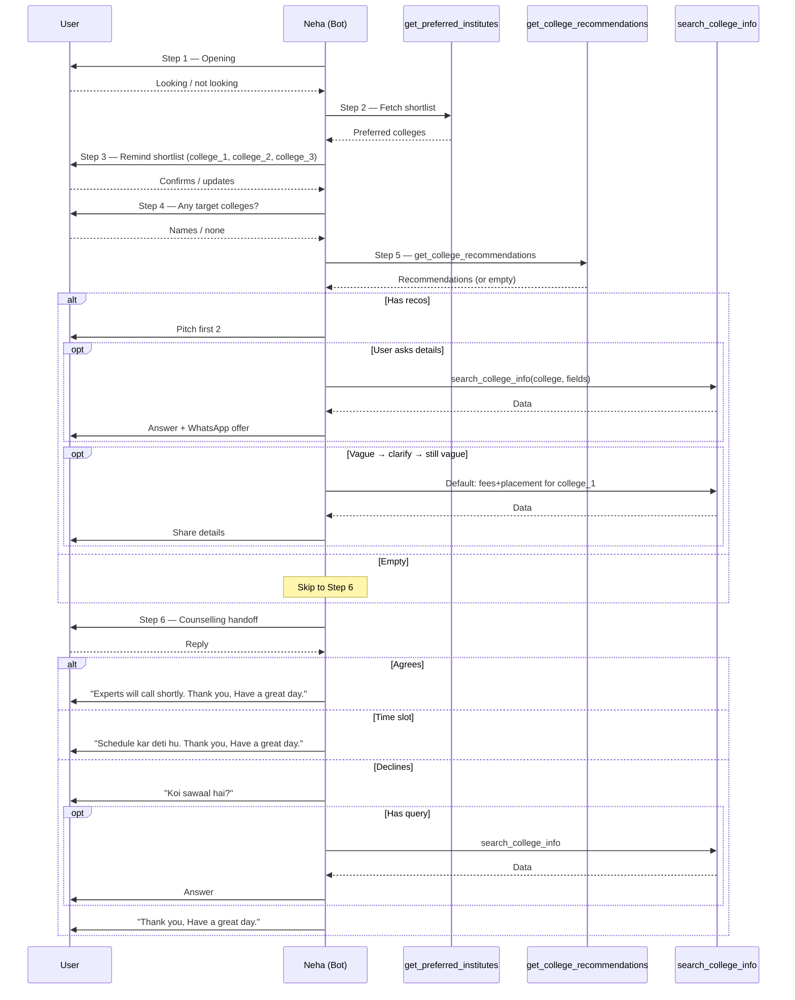
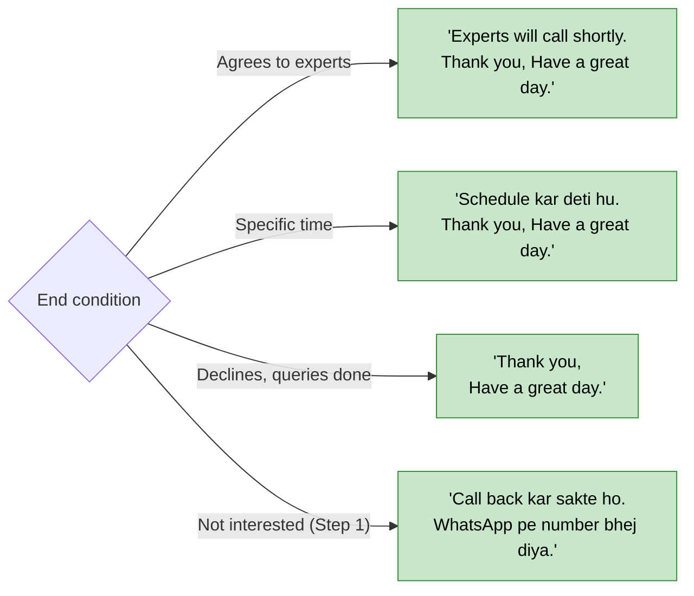

# SHORTLIST BOT — CALL FLOW (v0 — Original)

Visual reference for [v0_original_system_prompt.md](v0_original_system_prompt.md). Step numbering matches the prompt's Section 4.

---

## 1. Master Flow

```mermaid
flowchart TD
    Start([Call Connects]) --> S1["STEP 1: Opening<br/>'Aap B.Tech karne mein<br/>interested the — apna college<br/>mil raha hai ya aur<br/>options dekh rahe ho?'"]

    S1 --> Q1{User response?}
    Q1 -- "Looking for colleges" --> S2
    Q1 -- "Not looking" --> RETRY["'Main aapki B.Tech admission<br/>mein help kar doon —<br/>kuch important steps<br/>discuss kar lete hain?'"]
    Q1 -- "Not interested at all" --> END_EARLY(["'Call back kar sakte ho.<br/>WhatsApp pe number bhej<br/>diya hai.'"])

    RETRY --> QRETRY{Engages?}
    QRETRY -- "Yes" --> S2
    QRETRY -- "No" --> END_EARLY

    S2["STEP 2: Fetch Shortlist<br/>TOOL: get_preferred_institutes"]
    S2 --> S3

    S3["STEP 3: Remind Previous Interest<br/>'Aapne pehle B.Tech mein<br/>interest dikhaya tha —<br/>college_1, college_2, college_3.<br/>Abhi bhi inhi ko shortlist<br/>kar rahe ho?'"]
    S3 --> Q3{Response?}
    Q3 -- "Confirms shortlist" --> S4
    Q3 -- "Updates / new colleges" --> ACK["Acknowledge changes"] --> S4

    S4["STEP 4: Ask Target Colleges<br/>'Koi specific colleges<br/>mind mein hain?'"]
    S4 --> Q4{Response?}
    Q4 -- "Names colleges" --> ACK4["Acknowledge"] --> S5
    Q4 -- "No specific" --> S5
    Q4 -- "Asks details" --> S5_QUERY["Answer via<br/>search_college_info"] --> S5

    S5["STEP 5: Recommendations<br/>TOOL: get_college_recommendations<br/>Pitch first 2 from list"]
    S5 --> Q5{Tool returned?}
    Q5 -- "Empty" --> S6
    Q5 -- "Got results" --> PITCH["'college_1 aur college_2<br/>sahi honge aapke liye.<br/>Details chahiye?'"]

    PITCH --> Q5R{Reply?}
    Q5R -- "Specific query<br/>on a college" --> ANS["search_college_info<br/>→ answer + WhatsApp"] --> POST_ANS
    Q5R -- "Vague ('haan batao')" --> CLARIFY["'Kis college mein interested —<br/>college_1 ya college_2?<br/>Fees ya placements?'"]
    Q5R -- "'Both' / 'dono'" --> PULL_BOTH["Pull fees+placement<br/>for both"] --> POST_ANS
    Q5R -- "Satisfied / no questions" --> S6
    Q5R -- "More recos" --> MORE["Provide next colleges<br/>from same tool list"] --> POST_ANS

    CLARIFY --> QC{Still vague?}
    QC -- "Specifies" --> ANS
    QC -- "Still vague" --> DEFAULT["Default: fees+placement<br/>for college_1"] --> POST_ANS

    POST_ANS["'WhatsApp pe details<br/>share kar dungi'"]
    POST_ANS --> QFU{More follow-ups?}
    QFU -- "Yes" --> ANS
    QFU -- "No" --> S6

    S6["STEP 6: Counselling Handoff<br/>'Experts se free mein<br/>baat kar sakte ho —<br/>abhi connect kar doon?'"]
    S6 --> Q6{Reply?}
    Q6 -- "Yes, now" --> END_NOW(["'Experts will call shortly.<br/>Thank you, Have a great day.'"])
    Q6 -- "Specific time" --> END_SLOT(["'Us time pe schedule<br/>kar deti hu.<br/>Thank you, Have a great day.'"])
    Q6 -- "Declines" --> LAST["'College admission ke<br/>baare mein koi sawaal<br/>poochna chahenge?'"]

    LAST --> QL{Query?}
    QL -- "Yes" --> LAST_ANS["search_college_info<br/>→ answer"] --> END_DECLINE
    QL -- "No" --> END_DECLINE(["'Thank you,<br/>Have a great day.'"])

    classDef tool fill:#e1f5ff,stroke:#0288d1,color:#000
    classDef endNode fill:#c8e6c9,stroke:#388e3c,color:#000
    classDef decision fill:#fff9c4,stroke:#f9a825,color:#000
    class S2,S5,ANS,PULL_BOTH,DEFAULT,LAST_ANS,S5_QUERY,MORE tool
    class S1,S3,S4,S6,PITCH,CLARIFY,POST_ANS tool
    class END_EARLY,END_NOW,END_SLOT,END_DECLINE endNode
    class Q1,Q3,Q4,Q5,Q5R,Q6,QL,QC,QFU,QRETRY decision
```

---

## 2. Tool Call Sequence

---

## 3. End-of-Call Triggers

---

## 4. Step → Tool Map

| Step | Required Tool | Purpose |
|------|--------------|---------|
| 1 | — | Opening |
| 2 | `get_preferred_institutes` | Fetch shortlist |
| 3 | *(uses Step 2 data)* | Remind shortlist |
| 4 | — | Ask target colleges |
| 5 | `get_college_recommendations` | Recommend + `search_college_info` for follow-ups |
| 6 | — (+ `search_college_info` if last query) | Counselling handoff |

---

## 5. Key Differences from v0.1+

| | v0 (this file) | v0.1+ |
|---|---|---|
| Steps 2–4 | Separate fetch → remind → ask target | Merged into fewer steps |
| Re-engagement | Simple retry or end | Deadline urgency + backup framing |
| Shortlist reminder | Lists up to 3 colleges + asks to add/remove | Max 2 + directly offers recos |
| Vague handling | 3-tier (clarify → both → default) | Same pattern |
| College names | Short names + location in speech | Varies by version |
| End trigger (Step 1 refusal) | WhatsApp number mention | Counselling offer |
