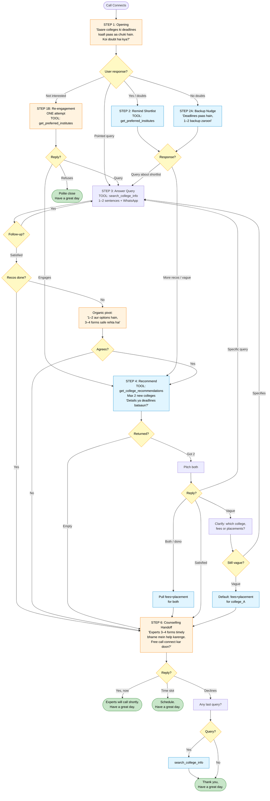
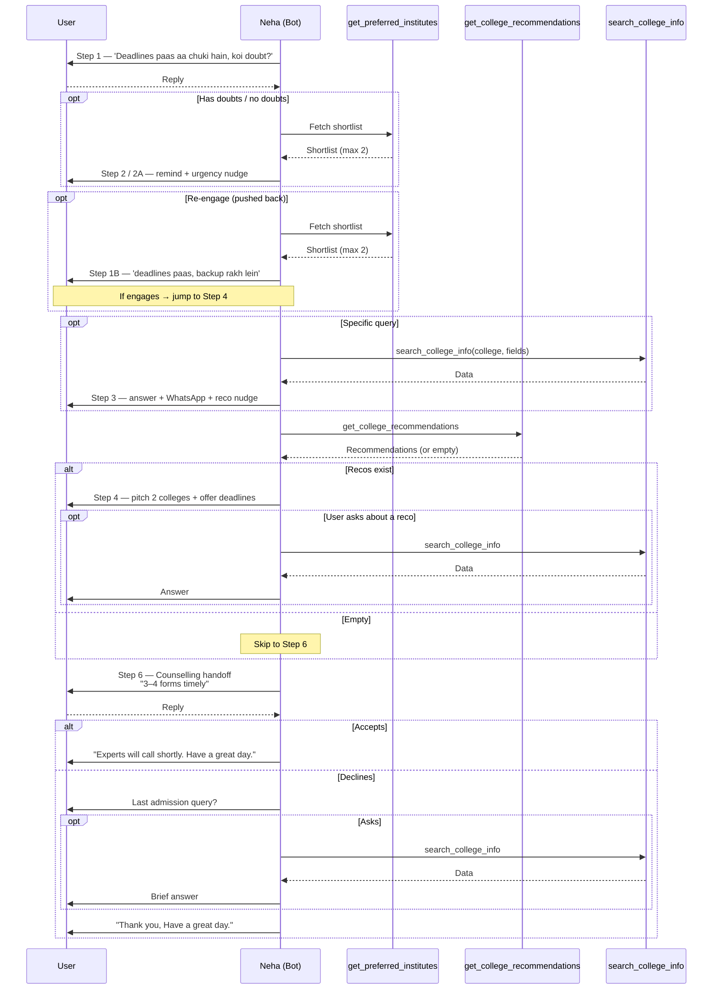
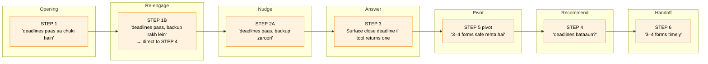
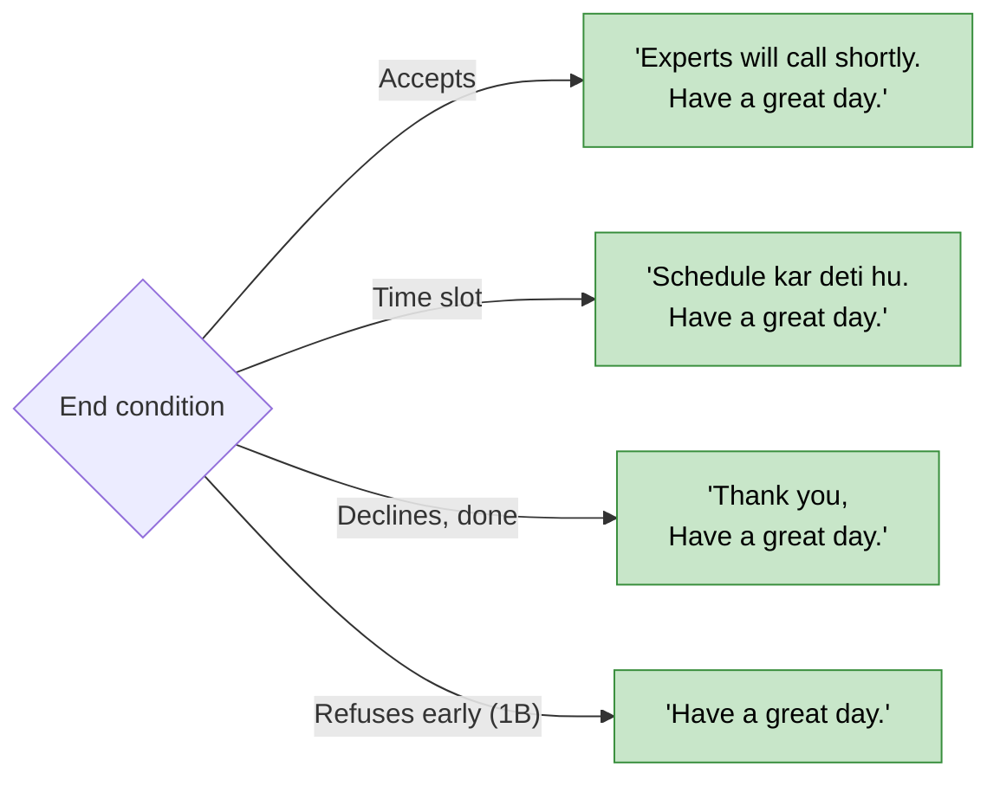

# SHORTLIST BOT — CALL FLOW (v1.02 — Urgency)

Visual reference for [v1.02-urgency.md](v1.02-urgency.md). All step IDs match the prompt's Section 8.

> **Variant intent:** Course-agnostic v1 flow with urgency woven into scripts at every node. Deadline framing in opening, backup nudge, 3–4 forms target in handoff.

---

## 1. Master Flow

---

## 2. Tool Call Sequence

---

## 3. Urgency Touchpoints

> Urgency is a **script overlay**, not a separate step. Cues rotate: "deadlines paas", "backup zaroori", "3–4 forms safe", "apply in time".

---

## 4. End-of-Call Triggers

---

## 5. Step → Tool Map

| Step | Required Tool | Skip Condition |
|------|--------------|----------------|
| 1 | — | — |
| 1B | `get_preferred_institutes` | User didn't push back |
| 2 | `get_preferred_institutes` | — |
| 2A | `get_preferred_institutes` | User had doubts in Step 1 |
| 3 | `search_college_info` | — |
| 4 | `get_college_recommendations` | — |
| 5 | `search_college_info` (follow-ups) | User satisfied |
| 6 | — | — |
