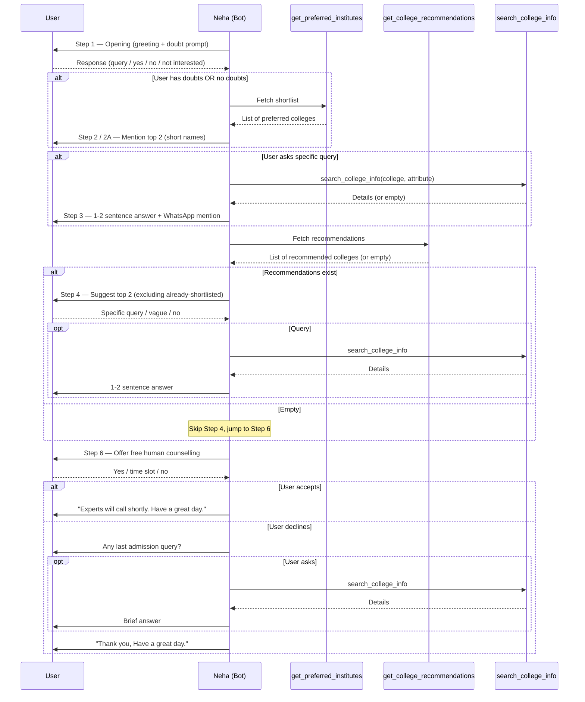
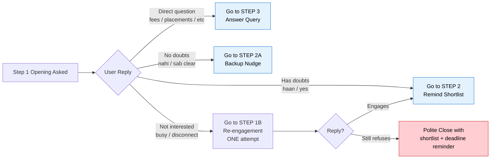
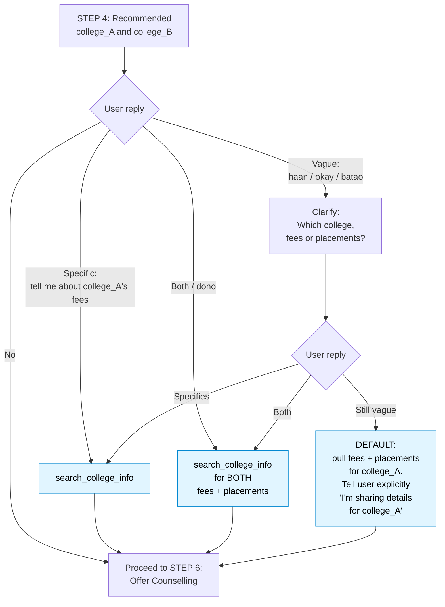
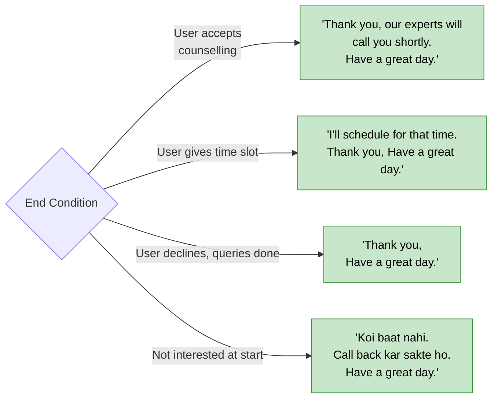

# SHORTLIST BOT — CALL FLOW (v1)

Visual reference for [v1_system_prompt.md](v1_system_prompt.md). All step numbers match the prompt's Section 8.

---

## 1. Master Flow

```mermaid
flowchart TD
    Start([Call Connects]) --> S1[STEP 1: Opening<br/>Hi Neha from Shiksha.<br/>You shortlisted some colleges<br/>for &#123;&#123;Course&#125;&#125; — any doubts?]

    S1 --> Q1{User response?}
    Q1 -->|Pointed query<br/>e.g. fees of NIT JSR| S3
    Q1 -->|Yes, has doubts| S2[STEP 2: Remind Shortlist<br/>TOOL: get_preferred_institutes]
    Q1 -->|No doubts| S2A[STEP 2A: Backup Nudge<br/>Deadlines are near.<br/>Backup is important.<br/>TOOL: get_preferred_institutes]
    Q1 -->|Not interested<br/>busy / abhi nahi| S1B[STEP 1B: Re-engagement<br/>TOOL: get_preferred_institutes<br/>Remind shortlist + deadline<br/>+ backup framing<br/>ONE attempt only]

    S1B --> Q1B{User reply?}
    Q1B -->|Engages| S2
    Q1B -->|Asks query| S3
    Q1B -->|Still refuses| END_EARLY([Polite close with<br/>shortlist + deadline reminder<br/>Have a great day])

    S2 --> S2Q[Mention max 2 colleges<br/>short names + location.<br/>Doubts on these or<br/>want more recos?]
    S2A --> S2AQ[Mention max 2 shortlisted.<br/>Doubts on these or<br/>add backups?]

    S2Q --> Q2{User response?}
    S2AQ --> Q2

    Q2 -->|Asks query about<br/>shortlisted college| S3
    Q2 -->|Wants more colleges| S4
    Q2 -->|Vague / unsure| S4

    S3[STEP 3: Answer Query<br/>TOOL: search_college_info<br/>1-2 short sentences<br/>Mention WhatsApp once] --> S5{Follow-up?}
    S5 -->|Yes, 1-2 more| S3
    S5 -->|No, satisfied| Q3{Already<br/>recommended?}

    Q3 -->|No| S4[STEP 4: Recommend<br/>TOOL: get_college_recommendations<br/>Top 2, exclude already-shortlisted]
    Q3 -->|Yes| S6

    S4 --> Q4{Tool returned<br/>colleges?}
    Q4 -->|Empty| S6
    Q4 -->|Got 2| S4Q[Suggest 2 colleges<br/>short names + location.<br/>Want details on either?]

    S4Q --> Q5{User response?}
    Q5 -->|Specific query| S3
    Q5 -->|Vague yes| VAGUE[Clarify: which college,<br/>fees or placements?]
    Q5 -->|No more questions| S6

    VAGUE --> Q6{Still vague?}
    Q6 -->|Specifies| S3
    Q6 -->|Says 'both'| BOTH[search_college_info<br/>fees + placements<br/>for BOTH] --> S6
    Q6 -->|Still vague| DEFAULT[Default: pull fees+placements<br/>for college 1<br/>Mention you're sharing<br/>details for college 1] --> S6

    S6[STEP 6: Offer Free<br/>Human Counselling]
    S6 --> Q7{User response?}
    Q7 -->|Yes, now| END_NOW([Thank you, our experts<br/>will call you shortly.<br/>Have a great day.])
    Q7 -->|Specific time slot| END_SLOT([I'll schedule for that time.<br/>Thank you, Have a great day.])
    Q7 -->|Declines| LAST[Any college admission<br/>question I can help with?]

    LAST --> Q8{Last query?}
    Q8 -->|Yes| LAST_ANS[search_college_info<br/>Answer briefly] --> END_DECLINE
    Q8 -->|No| END_DECLINE([Thank you,<br/>Have a great day.])

    classDef tool fill:#e1f5ff,stroke:#0288d1,color:#000
    classDef endNode fill:#c8e6c9,stroke:#388e3c,color:#000
    classDef decision fill:#fff9c4,stroke:#f9a825,color:#000
    class S2,S2A,S3,S4,LAST_ANS,BOTH,DEFAULT tool
    class END_EARLY,END_NOW,END_SLOT,END_DECLINE endNode
    class Q1,Q2,Q3,Q4,Q5,Q6,Q7,Q8,S5 decision
```

---

## 2. Tool Call Sequence

---

## 3. Decision Logic at STEP 1 (Opening)

---

## 4. Vague-Affirmative Handler (after recommendations)

---

## 5. End-of-Call Triggers

The system listens for specific closing phrases. Neha's **final spoken turn must contain one of these**:

---

## 6. Quick Reference — Step → Tool Map

| Step | Required Tool                  | Optional Tool         | Skip Condition                      |
| ---- | ------------------------------ | --------------------- | ----------------------------------- |
| 1    | —                              | —                     | —                                   |
| 2    | `get_preferred_institutes`     | —                     | Never skip                          |
| 2A   | `get_preferred_institutes`     | —                     | Only entered if user said no doubts |
| 3    | `search_college_info`          | —                     | If tool returns empty → graceful fallback |
| 4    | `get_college_recommendations`  | `search_college_info` | If recos empty → jump to STEP 6     |
| 5    | `search_college_info`          | —                     | After 1–2 follow-ups → STEP 6       |
| 6    | —                              | `search_college_info` | Final step always                   |
