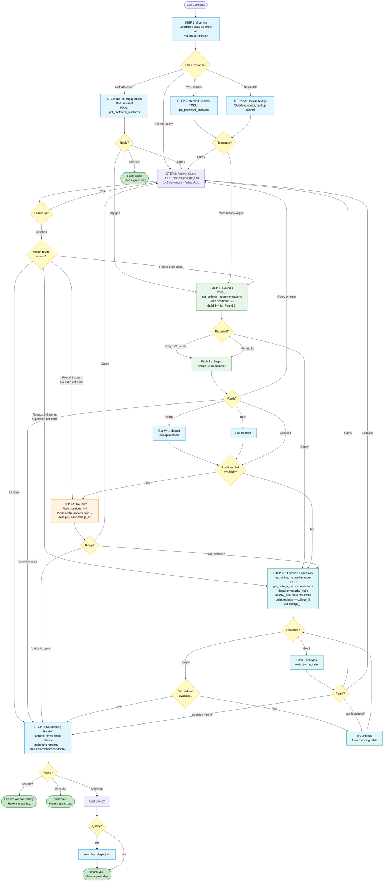
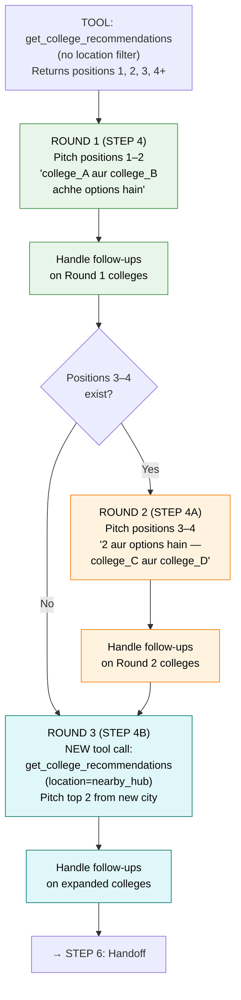
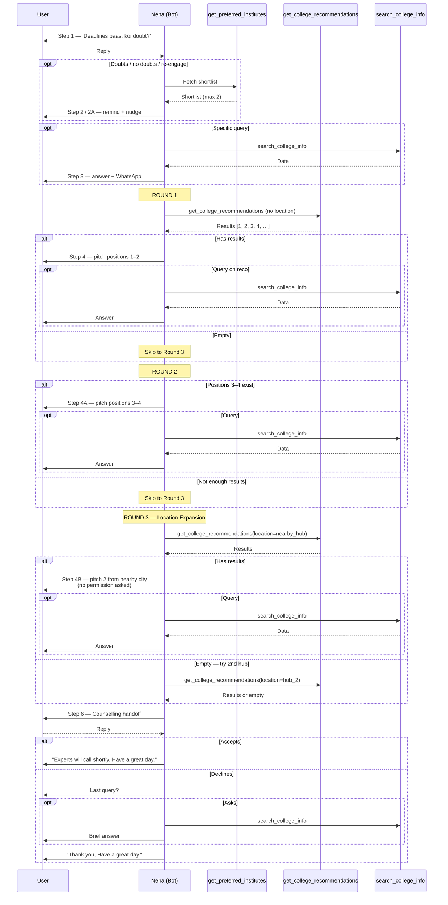
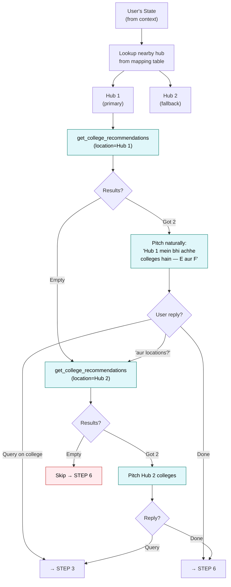
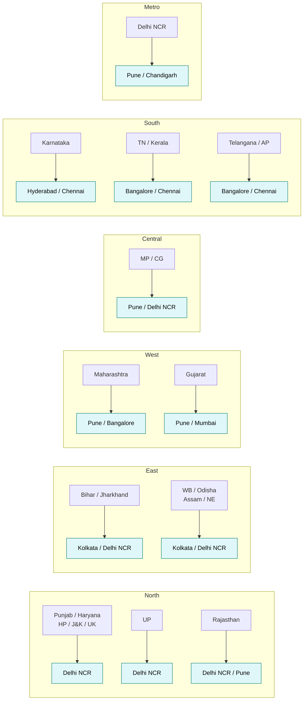
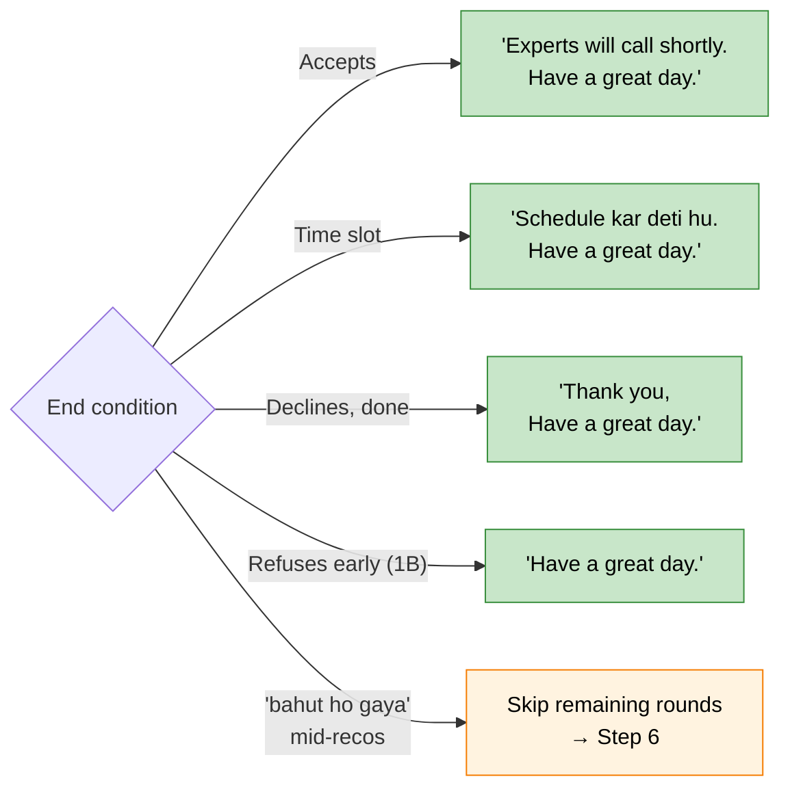

# SHORTLIST BOT — CALL FLOW (v1 — Expanded Recommendations)

Visual reference for [v1_expanded_recos_system_prompt.md](v1_expanded_recos_system_prompt.md). All step IDs match the prompt's Section 8.

> **Variant intent:** Same v1 flow + urgency, but with **3 recommendation rounds** so the student leaves the call with 6–8 college options. Round 1 = positions 1–2 from tool. Round 2 = positions 3–4 from same tool result. Round 3 = proactive location expansion to a nearby metro/hub (Neha suggests it herself, no confirmation asked).

---

## 1. Master Flow

---

## 2. Recommendation Rounds (detail view)

> **"bahut ho gaya" escape:** At any point if the user says they have enough → skip remaining rounds, jump to STEP 6.

---

## 3. Tool Call Sequence

---

## 4. Location Expansion Logic (STEP 4B)

---

## 5. State → Hub Mapping

---

## 6. End-of-Call Triggers

---

## 7. Step → Tool Map

| Step | Tool | What it does | Skip Condition |
|------|------|-------------|----------------|
| 1 | — | Opening | — |
| 1B | `get_preferred_institutes` | Re-engage with shortlist | User didn't push back |
| 2 | `get_preferred_institutes` | Remind shortlist | — |
| 2A | `get_preferred_institutes` | Backup nudge | User had doubts |
| 3 | `search_college_info` | Answer query | — |
| 4 | `get_college_recommendations` | Round 1: positions 1–2 | — |
| 4A | *(uses cached results)* | Round 2: positions 3–4 | <4 results from Step 4 |
| 4B | `get_college_recommendations(location=hub)` | Round 3: location expansion | User said "bahut ho gaya" |
| 5 | `search_college_info` | Follow-ups | User satisfied |
| 6 | — | Counselling handoff | — |
