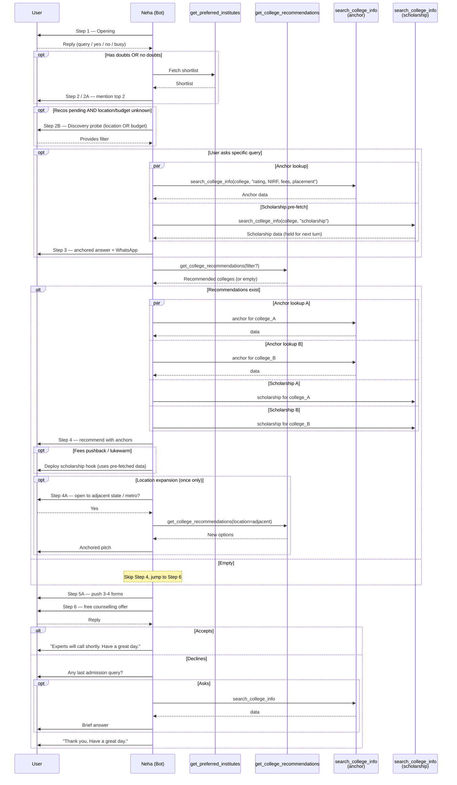
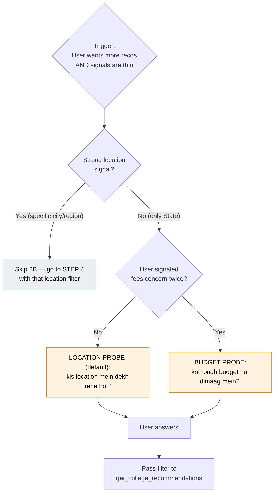
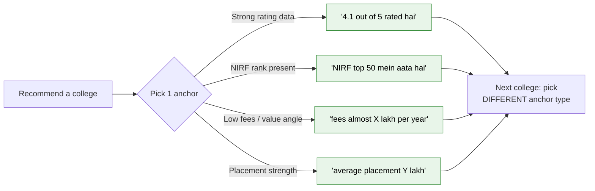
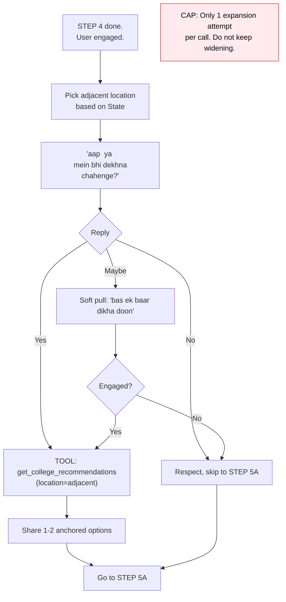
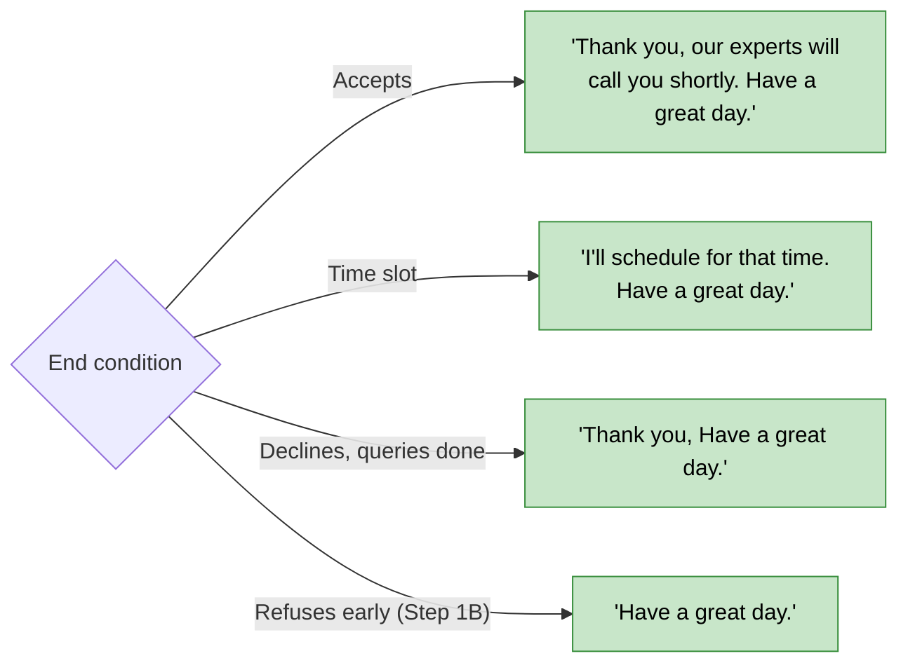

# SHORTLIST BOT — CALL FLOW (v2a — Discovery & Anchor)

Visual reference for [v2a_discovery_anchor_system_prompt.md](v2a_discovery_anchor_system_prompt.md). All step IDs match the prompt's Section 8.

> **Variant signature:** Consultative — discovery probe (location/budget) when shortlist is thin → anchored recommendations (rating + NIRF + fees + placement) → one-shot location expansion → measured urgency → handoff.

---

## 1. Master Flow

```mermaid
flowchart TD
    Start([Call Connects]) --> S1["STEP 1: Opening<br/>Hi Neha from Shiksha.<br/>You shortlisted some {{Course}}<br/>colleges — any doubts?"]

    S1 --> Q1{User response?}
    Q1 -- "Pointed query" --> S3
    Q1 -- "Yes, has doubts" --> S2["STEP 2: Remind Shortlist<br/>TOOL: get_preferred_institutes"]
    Q1 -- "No doubts" --> S2A["STEP 2A: Backup Nudge<br/>Deadlines near, backup framing"]
    Q1 -- "Not interested" --> S1B["STEP 1B: Re-engagement<br/>ONE attempt only<br/>TOOL: get_preferred_institutes"]

    S1B --> Q1B{Reply?}
    Q1B -- "Engages" --> S2
    Q1B -- "Asks query" --> S3
    Q1B -- "Refuses" --> END_EARLY([Polite close<br/>Have a great day])

    S2 --> Q2{User response?}
    S2A --> Q2

    Q2 -- "Query about shortlist" --> S3
    Q2 -- "More recos AND<br/>location/budget known" --> S4
    Q2 -- "More recos AND<br/>location/budget UNKNOWN" --> S2B["STEP 2B: Discovery Probe<br/>Ask ONE: location OR budget<br/>(not both)"]
    Q2 -- "Vague / unsure" --> S2B

    S2B --> S4

    S3["STEP 3: Answer Query<br/>PARALLEL TOOLS:<br/>1. anchor lookup<br/>(rating, NIRF, fees, placement)<br/>2. scholarship lookup<br/>(held for next turn)"]
    S3 --> S3R["Reply: anchored data + WhatsApp"]
    S3R --> S5{Follow-up?}
    S5 -- "Yes, 1-2 more" --> S3
    S5 -- "Satisfied" --> Q3{Recos done?}

    Q3 -- "No" --> S2B_OR_S4{Location known?}
    S2B_OR_S4 -- "No" --> S2B
    S2B_OR_S4 -- "Yes" --> S4
    Q3 -- "Yes" --> S5A

    S4["STEP 4: Recommend<br/>TOOL: get_college_recommendations<br/>(with location filter if available)<br/>+ PARALLEL anchor + scholarship<br/>lookups for both colleges"]
    S4 --> Q4{Tool returned?}
    Q4 -- "Empty" --> S6
    Q4 -- "Got 2" --> S4Q["Pitch with 1 anchor each<br/>Vary: rating / NIRF / fees / placement"]

    S4Q --> Q5{User reply?}
    Q5 -- "Specific query" --> S3
    Q5 -- "Vague" --> VAGUE["Clarify: which college,<br/>fees or placements?"]
    Q5 -- "Both" --> BOTH["Pull fees+placements<br/>for BOTH"] --> SCHO_HOOK
    Q5 -- "No more" --> SCHO_HOOK
    Q5 -- "Fees pushback /<br/>lukewarm" --> SCHO_HOOK["Deploy scholarship hook<br/>(if pre-fetched data exists)"]

    VAGUE --> Q6{Still vague?}
    Q6 -- "Specifies" --> S3
    Q6 -- "Both" --> BOTH
    Q6 -- "Vague" --> DEFAULT["DEFAULT: fees+placement+scholarship<br/>for college_A"] --> SCHO_HOOK

    SCHO_HOOK --> S4A["STEP 4A: Location Expansion<br/>(ONE attempt only)<br/>Probe adjacent state / metro<br/>based on user State"]

    S4A --> Q4A{User reply?}
    Q4A -- "Yes" --> S4_LOC["TOOL: get_college_recommendations<br/>(location=adjacent)<br/>Share 1-2 anchored options"]
    Q4A -- "No / maybe" --> S5A
    S4_LOC --> S5A

    S5A["STEP 5A: Application Urgency Push<br/>Recommend 3-4 forms<br/>'seats fill fast,<br/>deadlines this month'"]
    S5A --> S6

    S6["STEP 6: Free Counselling Handoff"]
    S6 --> Q7{Reply?}
    Q7 -- "Yes, now" --> END_NOW([Experts will call shortly.<br/>Have a great day.])
    Q7 -- "Time slot" --> END_SLOT([Schedule for that time.<br/>Have a great day.])
    Q7 -- "Declines" --> LAST["Any last admission query?"]

    LAST --> Q8{Last query?}
    Q8 -- "Yes" --> LAST_ANS["search_college_info<br/>Brief answer"] --> END_DECLINE
    Q8 -- "No" --> END_DECLINE([Thank you,<br/>Have a great day.])

    classDef tool fill:#e1f5ff,stroke:#0288d1,color:#000
    classDef parallel fill:#f3e5f5,stroke:#8e24aa,color:#000
    classDef discovery fill:#fff3e0,stroke:#f57c00,color:#000
    classDef endNode fill:#c8e6c9,stroke:#388e3c,color:#000
    classDef decision fill:#fff9c4,stroke:#f9a825,color:#000
    class S2,S2A,LAST_ANS,BOTH,DEFAULT tool
    class S3,S4,S4_LOC parallel
    class S2B,S4A,S5A,SCHO_HOOK discovery
    class END_EARLY,END_NOW,END_SLOT,END_DECLINE endNode
    class Q1,Q1B,Q2,Q3,Q4,Q5,Q6,Q7,Q8,Q4A,S5,S2B_OR_S4 decision
```

---

## 2. Tool Call Sequence (with parallel anchor + scholarship lookups)

---

## 3. Discovery Probe Logic (STEP 2B)

> **Rule:** Ask **only ONE** probe per call. Never both in same turn.

---

## 4. Anchor Selection Logic (STEP 3 / 4)

> **Rule:** Don't stack all 4 anchors. 1 per college mention, max 2. Vary across colleges in same turn.

---

## 5. Location Expansion (STEP 4A — one-shot)

---

## 6. End-of-Call Triggers

---

## 7. Step → Tool Map

| Step | Required Tool                  | Parallel Tool                  | Skip Condition                            |
| ---- | ------------------------------ | ------------------------------ | ----------------------------------------- |
| 1    | —                              | —                              | —                                         |
| 1B   | `get_preferred_institutes`     | —                              | User did not push back in Step 1          |
| 2    | `get_preferred_institutes`     | —                              | —                                         |
| 2A   | `get_preferred_institutes`     | —                              | User had doubts in Step 1                 |
| 2B   | —                              | —                              | Location AND budget already known         |
| 3    | `search_college_info` (anchor) | `search_college_info` (schol.) | —                                         |
| 4    | `get_college_recommendations`  | `search_college_info` x4       | —                                         |
| 4A   | `get_college_recommendations`  | `search_college_info` x2       | User firmly anchored to L1 / refused once |
| 5A   | —                              | —                              | —                                         |
| 6    | —                              | —                              | —                                         |
