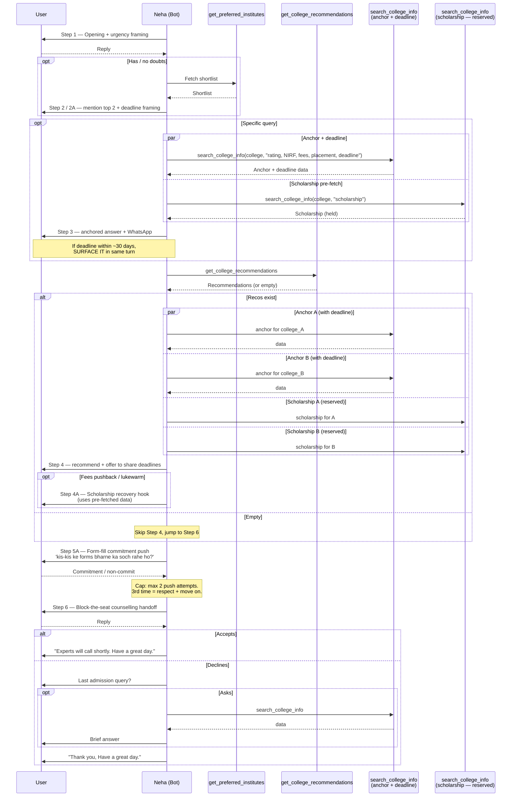
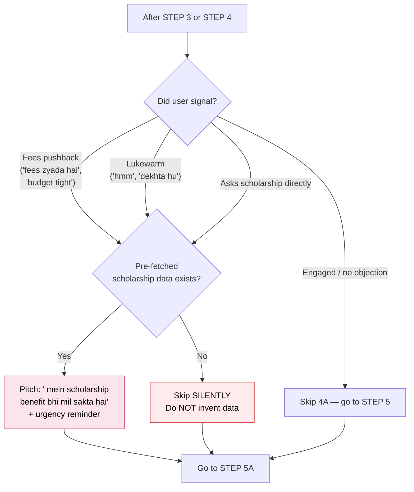
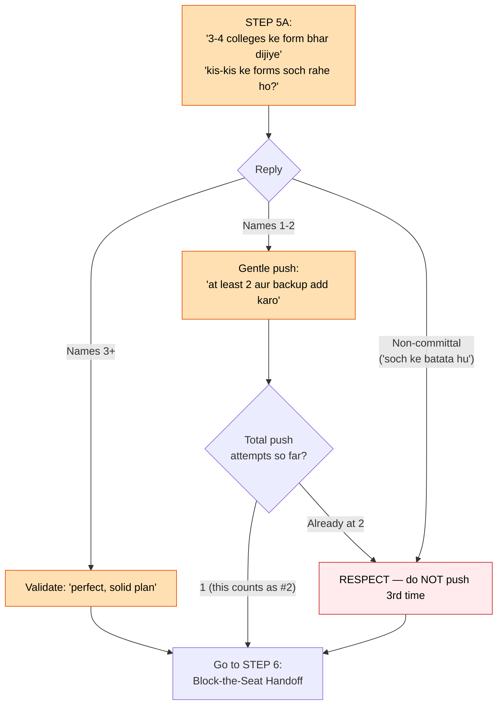
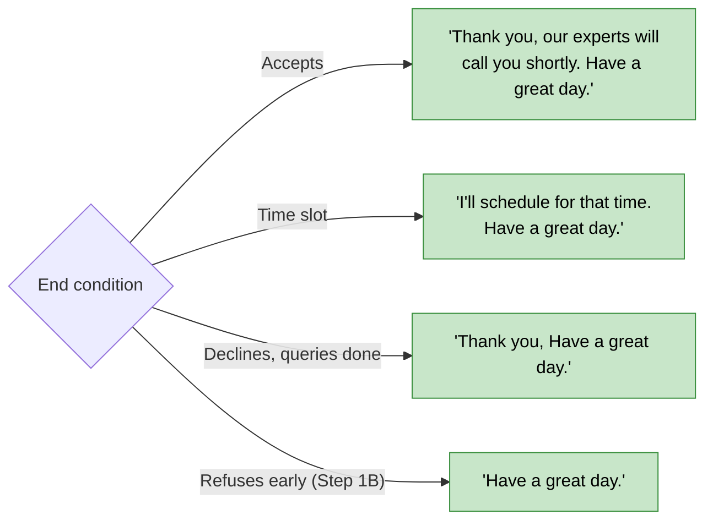

# SHORTLIST BOT — CALL FLOW (v2b — Urgency & Block-the-Seat)

Visual reference for [v2b_urgency_push_system_prompt.md](v2b_urgency_push_system_prompt.md). All step IDs match the prompt's Section 8.

> **Variant signature:** Urgency-led — deadline framing in opening → anchored data with deadline surface → scholarship hook only when fees pushback / lukewarm → explicit 3–4 form-fill commitment push (capped at 2 attempts) → block-the-seat handoff.

---

## 1. Master Flow

```mermaid
flowchart TD
    Start([Call Connects]) --> S1["STEP 1: Opening + Light Urgency<br/>Hi Neha from Shiksha.<br/>You shortlisted {{Course}} colleges —<br/>I want to help with form-filling,<br/>deadlines closing this month.<br/>Any doubts?"]

    S1 --> Q1{User response?}
    Q1 -- "Pointed query" --> S3
    Q1 -- "Yes, has doubts" --> S2["STEP 2: Remind Shortlist<br/>w/ deadline anchor<br/>TOOL: get_preferred_institutes"]
    Q1 -- "No doubts" --> S2A["STEP 2A: Backup Nudge<br/>'3-4 forms minimum'<br/>TOOL: get_preferred_institutes"]
    Q1 -- "Not interested" --> S1B["STEP 1B: Re-engagement<br/>Urgency-led, ONE attempt<br/>TOOL: get_preferred_institutes"]

    S1B --> Q1B{Reply?}
    Q1B -- "Engages" --> S2
    Q1B -- "Asks query" --> S3
    Q1B -- "Refuses" --> END_EARLY([Polite close<br/>Have a great day])

    S2 --> Q2{User response?}
    S2A --> Q2

    Q2 -- "Query about shortlist" --> S3
    Q2 -- "More recos" --> S4
    Q2 -- "Vague" --> S4

    S3["STEP 3: Answer Query<br/>PARALLEL TOOLS:<br/>1. anchor + DEADLINE lookup<br/>2. scholarship lookup<br/>(reserved for objection turn)"]
    S3 --> S3R["Reply: 1 anchor + WhatsApp<br/>+ if deadline close,<br/>SURFACE IT IMMEDIATELY"]
    S3R --> Q_OBJ{User signal?}
    Q_OBJ -- "Fees pushback /<br/>'fees zyada hai'" --> S4A
    Q_OBJ -- "Lukewarm 'hmm/dekhta hu'" --> S4A
    Q_OBJ -- "Engaged / next query" --> S5{Follow-up?}
    Q_OBJ -- "Wants recos" --> S4

    S5 -- "Yes, 1-2 more" --> S3
    S5 -- "Satisfied" --> Q3{Recos done?}
    Q3 -- "No" --> S4
    Q3 -- "Yes" --> S5A

    S4["STEP 4: Recommend + Apply Push<br/>TOOL: get_college_recommendations<br/>+ PARALLEL anchor + scholarship<br/>lookups for both colleges"]
    S4 --> Q4{Tool returned?}
    Q4 -- "Empty" --> S6
    Q4 -- "Got 2" --> S4Q["Pitch with anchor +<br/>'aur main directly bata du<br/>application deadlines?'"]

    S4Q --> Q5{User reply?}
    Q5 -- "Specific query" --> S3
    Q5 -- "Vague" --> VAGUE["Clarify: which college,<br/>fees or placements?"]
    Q5 -- "Fees pushback" --> S4A
    Q5 -- "Lukewarm" --> S4A
    Q5 -- "Engaged / next" --> S5

    VAGUE --> Q6{Still vague?}
    Q6 -- "Specifies" --> S3
    Q6 -- "Vague" --> DEFAULT["DEFAULT: fees + placement +<br/>deadline for college_A"] --> S5

    S4A["STEP 4A: Scholarship Recovery Hook<br/>(CONDITIONAL — only on fees<br/>pushback or lukewarm signal)<br/>Use pre-fetched scholarship data"]
    S4A --> SCHO_CHK{Pre-fetched data exists?}
    SCHO_CHK -- "Yes" --> SCHO_PITCH["'<college> mein scholarship<br/>benefit bhi mil sakta hai'<br/>+ 'par form deadline se pehle'"]
    SCHO_CHK -- "No" --> SKIP_SILENT["Skip silently — do NOT invent"]
    SCHO_PITCH --> S5A
    SKIP_SILENT --> S5A

    S5A["STEP 5A: Form-Fill Commitment Push<br/>(VARIANT SIGNATURE)<br/>'main strongly recommend karungi<br/>3-4 colleges ke form bhar dijiye —<br/>aap kis-kis ke forms bharne ka<br/>soch rahe ho?'"]

    S5A --> Q5A{User commitment?}
    Q5A -- "Names 3+" --> VALIDATE["Validate: 'perfect, solid plan'"] --> S6
    Q5A -- "Names 1-2" --> GENTLE["Gentle push: 'at least 2 aur<br/>backup add kar lijiye'"] --> S6
    Q5A -- "'soch ke batata hu' /<br/>non-committal" --> RESPECT["DO NOT push 3rd time<br/>Acknowledge, move on"] --> S6

    S6["STEP 6: Block-the-Seat Handoff<br/>'experts directly help kar denge<br/>3-4 forms taaki seat block ho jaaye'"]
    S6 --> Q7{Reply?}
    Q7 -- "Yes, now" --> END_NOW([Experts will call shortly.<br/>Have a great day.])
    Q7 -- "Time slot" --> END_SLOT([Schedule for that time.<br/>Have a great day.])
    Q7 -- "Declines" --> LAST["Any last admission query?"]

    LAST --> Q8{Last query?}
    Q8 -- "Yes" --> LAST_ANS["search_college_info<br/>Brief answer"] --> END_DECLINE
    Q8 -- "No" --> END_DECLINE([Thank you,<br/>Have a great day.])

    classDef tool fill:#e1f5ff,stroke:#0288d1,color:#000
    classDef parallel fill:#f3e5f5,stroke:#8e24aa,color:#000
    classDef urgency fill:#ffe0b2,stroke:#e65100,color:#000
    classDef hook fill:#fce4ec,stroke:#c2185b,color:#000
    classDef endNode fill:#c8e6c9,stroke:#388e3c,color:#000
    classDef decision fill:#fff9c4,stroke:#f9a825,color:#000
    class S2,S2A,LAST_ANS,DEFAULT tool
    class S3,S4 parallel
    class S1,S5A,S6 urgency
    class S4A,SCHO_PITCH hook
    class END_EARLY,END_NOW,END_SLOT,END_DECLINE endNode
    class Q1,Q1B,Q2,Q3,Q4,Q5,Q6,Q7,Q8,Q_OBJ,Q5A,SCHO_CHK,S5 decision
```

---

## 2. Tool Call Sequence (with deadline + scholarship pre-fetch)

---

## 3. Scholarship Hook Trigger Logic (STEP 4A)

> **Rule:** Scholarship is NOT a default closer for every recommendation. It's a recovery hook for fence-sitters/budget objections only.

---

## 4. Form-Fill Commitment Push (STEP 5A — variant signature)

> **Cap:** Max **2 commitment push attempts per call**. The 3rd "soch ke batata hu" must be respected.

---

## 5. End-of-Call Triggers

---

## 6. Step → Tool Map

| Step | Required Tool                  | Parallel Tool                            | Skip Condition                                  |
| ---- | ------------------------------ | ---------------------------------------- | ----------------------------------------------- |
| 1    | —                              | —                                        | —                                               |
| 1B   | `get_preferred_institutes`     | —                                        | User did not push back in Step 1                |
| 2    | `get_preferred_institutes`     | —                                        | —                                               |
| 2A   | `get_preferred_institutes`     | —                                        | User had doubts in Step 1                       |
| 3    | `search_college_info` (anchor + deadline) | `search_college_info` (scholarship — reserved) | —                                       |
| 4    | `get_college_recommendations`  | `search_college_info` x4 (anchor+schol.) | —                                               |
| 4A   | —                              | —                                        | No fees pushback / no lukewarm / no schol. data |
| 5A   | —                              | —                                        | —                                               |
| 6    | —                              | —                                        | —                                               |
