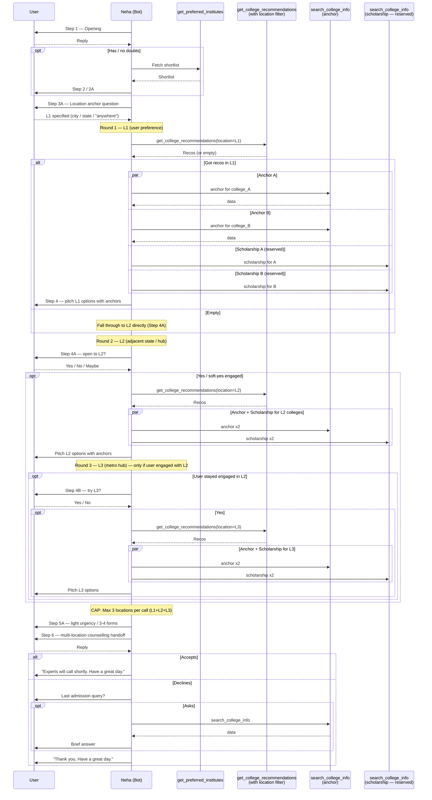
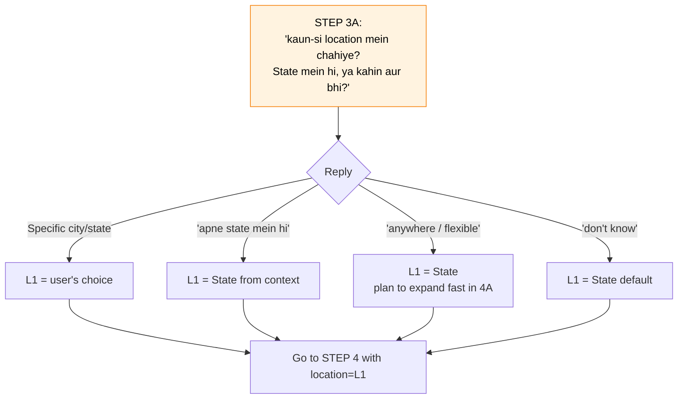
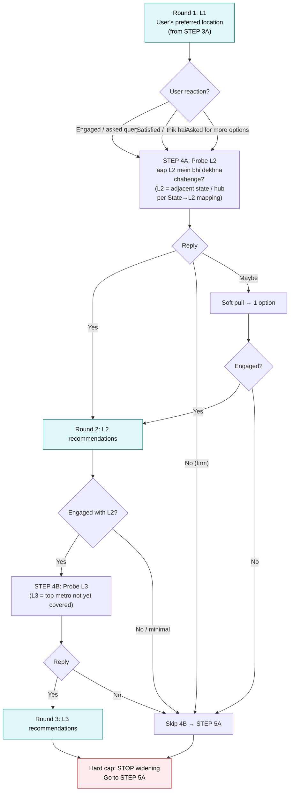
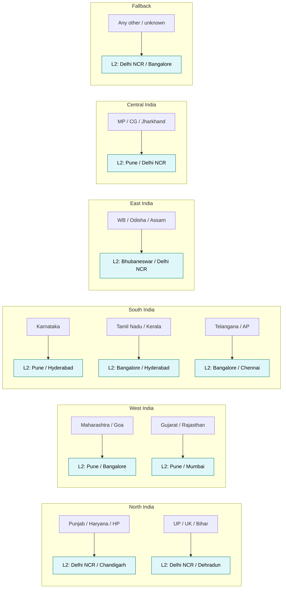
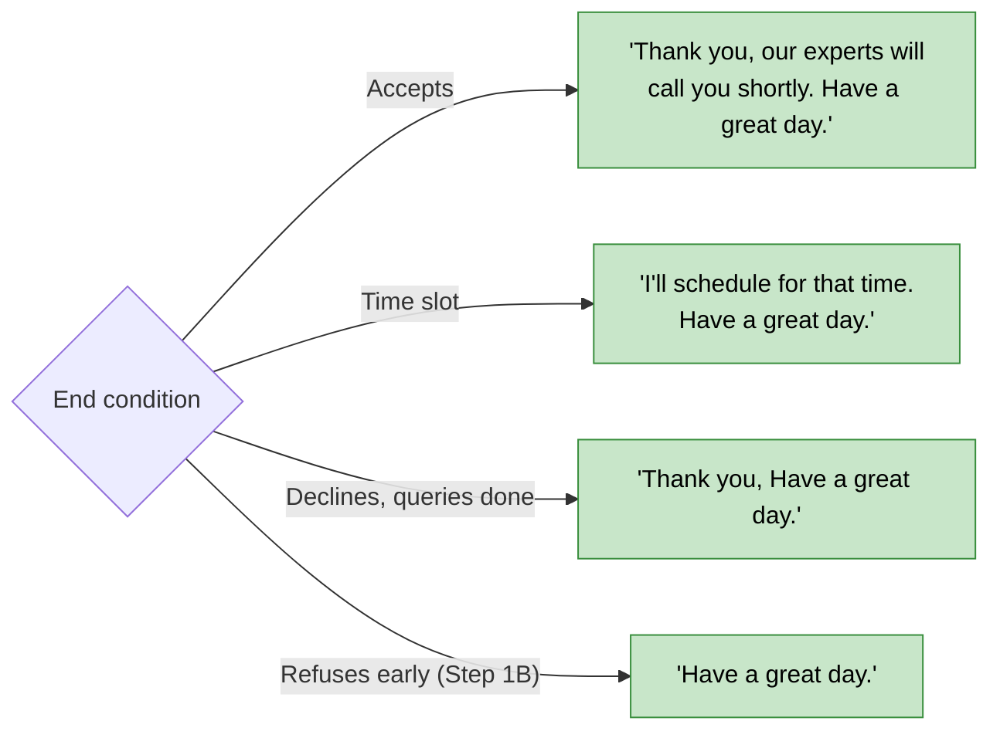

# SHORTLIST BOT — CALL FLOW (v2c — Location Expansion)

Visual reference for [v2c_location_expansion_system_prompt.md](v2c_location_expansion_system_prompt.md). All step IDs match the prompt's Section 8.

> **Variant signature:** Cross-sell — explicit location anchor question (STEP 3A) → recommend in L1 (preferred) → progressively widen to L2 (adjacent state / hub) → L3 (metro hub). Capped at 3 locations. Each new round uses an anchored data pitch.

---

## 1. Master Flow

```mermaid
flowchart TD
    Start([Call Connects]) --> S1["STEP 1: Opening<br/>Hi Neha from Shiksha.<br/>You shortlisted some {{Course}}<br/>colleges — any doubts?"]

    S1 --> Q1{User response?}
    Q1 -- "Pointed query" --> S3
    Q1 -- "Yes, has doubts" --> S2["STEP 2: Remind Shortlist<br/>TOOL: get_preferred_institutes"]
    Q1 -- "No doubts" --> S2A["STEP 2A: Backup Nudge<br/>'1-2 backup options,<br/>alag locations mein bhi'"]
    Q1 -- "Not interested" --> S1B["STEP 1B: Re-engagement<br/>ONE attempt only<br/>TOOL: get_preferred_institutes"]

    S1B --> Q1B{Reply?}
    Q1B -- "Engages" --> S2
    Q1B -- "Asks query" --> S3
    Q1B -- "Refuses" --> END_EARLY([Polite close<br/>Have a great day])

    S2 --> Q2{User response?}
    S2A --> Q2

    Q2 -- "Query about shortlist" --> S3
    Q2 -- "More recos / vague" --> S3A

    S3["STEP 3: Answer Query<br/>PARALLEL TOOLS:<br/>1. anchor lookup<br/>2. scholarship lookup<br/>(reserved for next turn)"]
    S3 --> S3R["Reply: anchored data + WhatsApp"]
    S3R --> S5{Follow-up?}
    S5 -- "Yes, 1-2 more" --> S3
    S5 -- "Satisfied" --> Q3{Recos done?}
    Q3 -- "No" --> S3A
    Q3 -- "Yes (all locations covered)" --> S5A

    S3A["STEP 3A: Location Anchor<br/>(VARIANT SIGNATURE OPENER)<br/>'Toh kaun-si location mein chahiye?<br/>State mein hi, ya kahin aur bhi?'"]

    S3A --> Q3A{Reply}
    Q3A -- "Specific city/state" --> SET_L1A["L1 = user's choice"]
    Q3A -- "'apne state mein hi'" --> SET_L1B["L1 = State from context"]
    Q3A -- "'flexible / anywhere'" --> SET_L1C["L1 = State<br/>(plan to expand fast)"]
    Q3A -- "'don't know'" --> SET_L1D["L1 = State (default)"]

    SET_L1A --> S4
    SET_L1B --> S4
    SET_L1C --> S4
    SET_L1D --> S4

    S4["STEP 4: Recommend in L1<br/>TOOL: get_college_recommendations<br/>(location=L1)<br/>+ PARALLEL anchor + scholarship<br/>lookups for both"]
    S4 --> Q4{Returned?}
    Q4 -- "Empty (no L1 options)" --> S4A_DIRECT["Fall through to STEP 4A directly<br/>'aapke specific location mein<br/>limited options aa rahe — try L2?'"]
    Q4 -- "Got 2" --> S4Q["Pitch with 1 anchor each"]

    S4Q --> Q5{User reply?}
    Q5 -- "Specific query" --> S3
    Q5 -- "Vague" --> VAGUE["Clarify: which college,<br/>fees or placements?"]
    Q5 -- "Satisfied" --> S4A
    Q5 -- "Aur options" --> S4A
    VAGUE --> Q6{Still vague?}
    Q6 -- "Specifies" --> S3
    Q6 -- "Vague" --> DEFAULT["DEFAULT: fees+placement<br/>for college_A"] --> S4A

    S4A_DIRECT --> S4A

    S4A["STEP 4A: Expand to L2<br/>(adjacent state / hub)<br/>'Hmm, aap L2 mein bhi<br/>dekhna chahenge?'"]
    S4A --> Q4A{Reply}
    Q4A -- "Yes" --> S4_L2["TOOL: get_college_recommendations<br/>(location=L2)<br/>Share 1-2 anchored options"]
    Q4A -- "No (firmly L1)" --> RESPECT_L1["Respect — skip 4B<br/>Go to STEP 5A"]
    Q4A -- "Maybe / shayad" --> SOFT["Soft pull:<br/>'bas ek dikha doon'"]
    SOFT --> SR{Engaged?}
    SR -- "Yes" --> S4_L2
    SR -- "No" --> RESPECT_L1

    S4_L2 --> Q4B{User engaged<br/>with L2 options?}
    Q4B -- "Yes" --> S4B
    Q4B -- "No / minimal" --> S5A

    S4B["STEP 4B: Expand to L3<br/>(metro hub)<br/>'Aur kon-konsi locations?<br/>L3 mein bhi 1-2 options hain'"]
    S4B --> Q4C{Reply}
    Q4C -- "Yes" --> S4_L3["TOOL: get_college_recommendations<br/>(location=L3)<br/>Share 1-2 anchored options"]
    Q4C -- "No" --> S5A
    S4_L3 --> S5A
    RESPECT_L1 --> S5A

    S5A["STEP 5A: Light Urgency<br/>'3-4 forms minimum,<br/>alag-alag locations mein bhi'"]
    S5A --> S6

    S6["STEP 6: Counselling Handoff<br/>'multi-location shortlist<br/>banake form-filling help karenge'"]
    S6 --> Q7{Reply?}
    Q7 -- "Yes, now" --> END_NOW([Experts will call shortly.<br/>Have a great day.])
    Q7 -- "Time slot" --> END_SLOT([Schedule for that time.<br/>Have a great day.])
    Q7 -- "Declines" --> LAST["Any last admission query?"]

    LAST --> Q8{Last query?}
    Q8 -- "Yes" --> LAST_ANS["search_college_info<br/>Brief answer"] --> END_DECLINE
    Q8 -- "No" --> END_DECLINE([Thank you,<br/>Have a great day.])

    classDef tool fill:#e1f5ff,stroke:#0288d1,color:#000
    classDef parallel fill:#f3e5f5,stroke:#8e24aa,color:#000
    classDef location fill:#e0f7fa,stroke:#00796b,color:#000
    classDef sig fill:#fff3e0,stroke:#f57c00,color:#000
    classDef endNode fill:#c8e6c9,stroke:#388e3c,color:#000
    classDef decision fill:#fff9c4,stroke:#f9a825,color:#000
    class S2,S2A,LAST_ANS,DEFAULT tool
    class S3,S4,S4_L2,S4_L3 parallel
    class S3A sig
    class S4A,S4B,SET_L1A,SET_L1B,SET_L1C,SET_L1D location
    class END_EARLY,END_NOW,END_SLOT,END_DECLINE endNode
    class Q1,Q1B,Q2,Q3,Q3A,Q4,Q4A,Q4B,Q4C,Q5,Q6,Q7,Q8,SR,S5 decision
```

---

## 2. Tool Call Sequence (with location-filtered recommendations)

---

## 3. Location Anchor Question (STEP 3A)

---

## 4. Location Expansion Ladder (L1 → L2 → L3)

> **Cap:** Max **3 locations per call** (L1 + L2 + L3). Do not keep widening beyond this.

---

## 5. State → L2 Mapping (sensible adjacencies)

---

## 6. End-of-Call Triggers

---

## 7. Step → Tool Map

| Step | Required Tool                              | Parallel Tool                  | Skip Condition                                        |
| ---- | ------------------------------------------ | ------------------------------ | ----------------------------------------------------- |
| 1    | —                                          | —                              | —                                                     |
| 1B   | `get_preferred_institutes`                 | —                              | User did not push back                                |
| 2    | `get_preferred_institutes`                 | —                              | —                                                     |
| 2A   | `get_preferred_institutes`                 | —                              | User had doubts in Step 1                             |
| 3    | `search_college_info` (anchor)             | `search_college_info` (schol.) | —                                                     |
| 3A   | —                                          | —                              | Recos already done in all 3 locations                 |
| 4    | `get_college_recommendations(location=L1)` | `search_college_info` x4       | —                                                     |
| 4A   | `get_college_recommendations(location=L2)` | `search_college_info` x4       | User firmly anchored to L1                            |
| 4B   | `get_college_recommendations(location=L3)` | `search_college_info` x4       | User declined L2 OR not engaged with L2               |
| 5A   | —                                          | —                              | —                                                     |
| 6    | —                                          | —                              | —                                                     |
